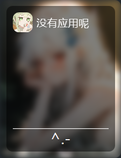

# 
Launcher

## 关于

这是一个使用javafx库编写的启动面板程序

## 提示

这是一个半半成品，还有很多功能没做  
脑子不够用，有想要的功能可以提出来(如果有人用的话)

## 已知BUG

- 多屏幕调用会出现错位

## 已实现功能

- 通过更改app.json添加或删除应用
- 通过手动添加重命名更改图标

## 代办

- [ ] 背景自定义
- [ ] 自动化添加app
- [ ] 自定义css
- [ ] 设置页面
- [ ] i18n多语言支持
- [ ] 刷新按钮
- [ ] 多平台
- [ ] 托盘图标
- 还有更多(等我想到)